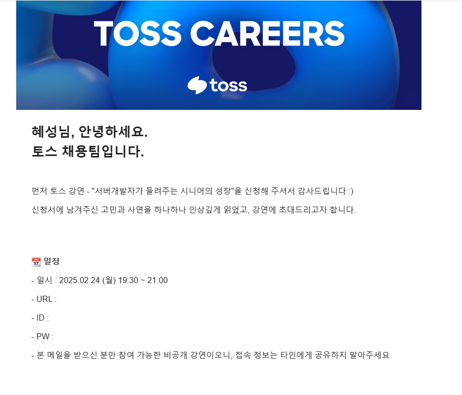

# 토스 서버개발자가 들려주는 시니어의 성장 강연

웹서핑중 우연히 보게된 토스에서 주최하는 강연 공고

서버 개발자이야기를 들려준다고 한다.

나로서는 쉽게 만날 수 없는 사람들의 이야기를 듣는다는게 너무 매력적으로 다가왔다.

고민할것도 없이 그냥 신청했다.

  

그리고 초대 메일을 받게 되었다.

  

월요일 퇴근시간이 되자마자 곧장 집으로 와서 책상에 앉았다.

초대 메일에 첨부된 링크로 Zoom 미팅룸에 접속하고 시간이 되기를 기다렸다.

  

시작 되었다.

3개의 세션으로 구성된 강연이었다.

  

## 첫번째 세션,

첫번째 세션 발표자는 스타업 근무 하다 대기업 입사하게 되었는데, 1년만에 다시 스타업으로 돌아갔다가, 현재 토스에서 근무중인 사람이다.

주도성에 대해 이야기 했었는데, 사용자와의 거리가 가까운 빠른 피드백을 경험할 수 있는 일을 선호 한다고 한다. 
나도 사용자의 즉각적인 피드백을 받을수 있는 처리를 할 떄 반응이 궁금해 흥미가 생겼던 기억이 떠올랐다.

다른 내용이 더 있었는데 시간이 흘러 어떤 내용이었는지 기억이 휘발되어 잘 기억나지 않는다.
  
  
  

## 두번째 세션,

  본인의 실수 경험담을 말하며, 이야기를 했는데 꽤 흥미진진하고 재미 있었다.
  **"기능은 추가하는것 보다 빼는게 어렵다."**
  반복적인 작업보다 생각할 여지가 많은 문제를 선호
  어떠한 문제가 있으면, 전사 구성원에게 전파되고, 구성원들이 머리를 맞대어 풀었던 경험이 인상 깊었다. 또한 문제를 해결하는 방식에 있어, 특정 기술을 사용할 때 메모리 부족 예시를 들었었는데 시스템의 스펙을 업하면 고민없이 해결될 문제지만 그러지 않고 근본적인 원인을 끝내 찾아서 해결하고, 이를 문서화 하여

## 세번째 세션,

각 연도별 발표자가 처리했던 업무와 관련 기술스택을 나열해줬다.
키워드를 얻을 수 있어 좋았다.

시니어라는 단어는 나와 관계없고, 나는 그들이 어떻게 일하는지, 어떤 생각을 하는지, 어떤 환경에서 일하는지 궁금했다. 본 강의 주제와는 달리 내가 궁금한점에 대해서만 포커스를 맞춰 강연을 들었다.